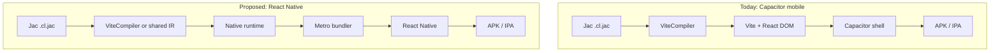

# React Native Target - Architecture & Planning Record

**Status:** approved - Phase 1 + Phase 2 + Phase 3 landed (branch `feat/react-native`)
**Last updated:** 2026-05-25
**Owner:** TBD

> **Decision (2026-05-23):** We are implementing the React Native target. Capacitor
> stays as a sibling option. See [Decision Log](#decision-log) for the full rationale
> and recorded design decisions before any code is written.

---

## Goal

Add a **React Native build target** to jac-client so Jac apps can compile to true native mobile apps (Android + iOS), not just WebView-wrapped web bundles.

Jac already ships mobile via **Capacitor** (`jac build --client mobile`), which reuses the Vite/React web bundle inside a native shell. That works, but the UX is still fundamentally a web app in a WebView. React Native uses platform-native views, better gesture/scroll performance, and access to the RN ecosystem - at the cost of a substantially different rendering and tooling stack.

This document is the living record of **what exists today**, **what must change**, **design options**, and **phased next steps**.

---

## Current State (as of 2026-05-23)

### How jac-client works today

```
Jac source (.jac / .cl.jac)
        │
        ▼
  ViteCompiler (Jac → JS modules in .jac/client/compiled/)
        │
        ▼
  ViteBundler (bundle with React, react-dom, react-router-dom, …)
        │
        ▼
  ClientTarget.build()  ──► artifact per target
```

| Target | Class | Extends | Output |
|--------|-------|---------|--------|
| `web` (default) | `WebTarget` | `ClientTarget` | `.jac/client/dist/` |
| `desktop` | `DesktopTarget` | `WebTarget` | Tauri bundle |
| `pwa` | `PWATarget` | `WebTarget` | PWA manifest + SW |
| `mobile` | `MobileTarget` | `WebTarget` | Capacitor APK / iOS app |

Key files:

- Target registry: `jac-client/jac_client/plugin/src/targets/registry.jac`
- Target registration: `jac-client/jac_client/plugin/src/targets/register.jac`
- Mobile (Capacitor): `jac-client/jac_client/plugin/src/targets/mobile_target.jac`
- Compiler pipeline: `jac-client/jac_client/plugin/src/compiler.jac`, `impl/compiler.impl.jac`
- Web runtime: `jac-client/jac_client/plugin/client_runtime.cl.jac`
- JSX helper: `__jacJsx` → `React.createElement` in `plugin/impl/client_runtime.impl.jac`
- Bundler: `jac-client/jac_client/plugin/src/vite_bundler.jac`

### What the web runtime assumes

The current `client_runtime.cl.jac` is **web-only**:

| Concern | Web implementation |
|---------|-------------------|
| Mount | `react-dom/client` `createRoot` |
| Routing | `react-router-dom` (`BrowserRouter`, `Routes`, `Route`, …) |
| JSX tags | HTML strings (`"div"`, `"span"`, `"button"`, …) via `__jacJsx` |
| Storage | `localStorage` |
| Navigation shim | `window.history.pushState` |
| Init data | `document.getElementById("__jac_init__")` |
| Error overlay | DOM-based `errorOverlay` |
| Styling | CSS files, className, inline styles |

Mobile (Capacitor) does **not** change any of this - it wraps the same web bundle.

### Mobile target CLI surface (Capacitor)

```bash
jac setup mobile [--platform android|ios|all]
jac start main.jac --client mobile [--dev] [--platform android|ios]
jac build --client mobile --platform android|ios
```

Docs: `docs/docs/tutorials/fullstack/mobile.md`

---

## Why React Native Is Harder Than Capacitor

Capacitor was a **packaging** problem: same JS bundle, different shell.

React Native is a **platform** problem: different component tree, different bundler, different navigation, different storage, different styling model, and many npm packages that only work on web.



---

## Design Options

### Option A - New target, native runtime, HTML→RN tag mapping (recommended starting point)

Add `ReactNativeTarget` (`name = "react-native"`) parallel to `MobileTarget`.

- **Compiler:** Reuse existing Jac→JS compilation (same `.cl.jac` AST lowering).
- **Runtime:** New `client_runtime_native.cl.jac` that imports from `react-native` instead of `react-dom`.
- **JSX:** Extend `__jacJsx` (or a native variant) to map common HTML tags → RN primitives:

  | HTML (web) | React Native |
  |------------|--------------|
  | `div`, `section`, `main` | `View` |
  | `span`, `p`, `h1`–`h6` | `Text` |
  | `button` | `Pressable` or `TouchableOpacity` |
  | `input` | `TextInput` |
  | `img` | `Image` |
  | `a` | `Text` + `Linking` or nav helper |

- **Bundler:** Metro (RN standard) instead of Vite for the native target.
- **Entry:** `AppRegistry.registerComponent` instead of `createRoot`.

**Pros:** Single Jac codebase for web + native where components are simple.
**Cons:** Mapping layer is incomplete (CSS, semantic HTML, many web-only patterns break). Hidden footguns for authors who use web-specific JSX.

### Option B - Keep platform selection out of app source

Do not introduce platform-selection conventions in Jac application files.
Selection remains a build concern driven by `--client` and target wiring.

**Pros:** No app-source magic; one clear control point (`--client`).
**Cons:** Less flexibility for app-level mixed web/native UI patterns.

### Option C - Logic-only sharing

Share only non-UI modules: API helpers, types, walker call wrappers, Zod schemas, i18n strings. Separate web and native UI trees.

**Pros:** Lowest risk; matches real-world RN+web projects.
**Cons:** Not "write once, run everywhere"; weaker Jac story.

### Option D - React Native Web inversion

Use `react-native` components everywhere and compile web via [React Native Web](https://github.com/necolas/react-native-web).

**Pros:** One component vocabulary.
**Cons:** Major break from current HTML/JSX Jac apps; web ecosystem (MUI, Tailwind, etc.) incompatible; large migration.

### Recommendation

**A + C (with flag-driven target selection):**

1. Ship **Option A** tag mapping for simple apps and prototyping.
2. Keep platform selection in `--client react-native` target behavior and
   entry/runtime/bundler wiring, not in application source conventions.
3. Document **Option C** as the escape hatch for complex apps (Ant Design, heavy DOM, etc.).

Do **not** pursue Option D unless we decide to rebuild the entire client runtime around RN primitives.

---

## Proposed Architecture

### New target: `ReactNativeTarget`

```
ReactNativeTarget(ClientTarget)   # does NOT extend WebTarget
  name = "react-native"
  requires_setup = True
  config_section = "react_native"
  output_dir = android/app/build/outputs  (or platform-specific)
```

Unlike `MobileTarget`, this target should **not** inherit `WebTarget.build()` - no Vite production bundle step for the native artifact (though dev may still compile Jac→JS the same way).

### Layer split

| Layer | Web (today) | React Native (proposed) | Shared? |
|-------|-------------|-------------------------|---------|
| Jac language / JSX syntax | ✓ | ✓ | Yes |
| Jac→JS compiler (`ViteCompiler`) | ✓ | ✓ (initially) | Yes |
| Client runtime | `client_runtime.cl.jac` | `client_runtime_native.cl.jac` | No - parallel |
| JSX dispatch | `__jacJsx` → HTML tags | `__jacJsxNative` → RN components | Partial |
| Router | react-router-dom | React Navigation (or expo-router) | No |
| Storage | localStorage | AsyncStorage / MMKV | No |
| Bundler | Vite | Metro | No |
| Native project | - | `npx react-native init` scaffold | No |
| Dev server | Vite HMR | Metro fast refresh | Different |

### Runtime API parity checklist

These `client_runtime.cl.jac` exports need native equivalents:

| Export | Web | Native plan |
|--------|-----|-------------|
| `__jacJsx` | `React.createElement("div", …)` | Map tags → RN components |
| `useState`, `useEffect` | react | react (same) |
| `Router`, `Routes`, `Route`, `Link`, … | react-router-dom | React Navigation adapter |
| `useRouter`, `navigate` | history API | navigation ref / hooks |
| `jacSpawn`, `__jacCallFunction` | fetch → API | fetch → API (same, adjust base URL) |
| `jacSignup`, `jacLogin`, `jacLogout` | localStorage tokens | AsyncStorage tokens |
| `AuthGuard` | `<Navigate>` | navigation redirect |
| `JacAwaiting` | `React.Suspense` | Suspense (RN 0.72+ experimental) or loading state |
| `useJacForm`, `JacForm` | react-hook-form + DOM | RN TextInput bindings |
| `__getApiBaseUrl` | Vite `define` | Metro env / app config |
| `errorOverlay` | DOM overlay | RN ErrorBoundary + dev menu |
| `__jacInstallErrorHandlers` | window.onerror | RN LogBox / custom handler |

### Bundler strategy

**Phase 1 - Metro consumes compiled Jac JS**

1. `ViteCompiler.compile()` writes to `.jac/client/compiled/` (no Vite bundle).
2. Metro config sets `watchFolders` + `resolver` so `@jac/runtime` → native runtime.
3. Entry: generated `index.native.js` registers root component.

**Phase 2 - Evaluate Metro-first or shared resolver**

- May need custom Jac Metro transformer later (compile `.cl.jac` inside Metro) for faster refresh.
- Defer until Phase 1 works end-to-end.

### Target selection model

React Native behavior is selected by the CLI target flag, not by special source
filename suffixes.

```
jac build --client web
jac build --client react-native
```

Both targets consume normal `*.cl.jac` modules; the selected target controls
runtime wiring, entry generation, bundler, and platform adapters.

### Navigation

Web uses file-based routing (`pages/`) + `BrowserRouter`. React Native has no URL bar in the same way.

| Approach | Notes |
|----------|-------|
| **React Navigation** (imperative) | Generate nav stack from Jac route metadata; mature ecosystem |
| **Expo Router** (file-based) | Closest to current `pages/` story; ties project to Expo |
| **Manual** | Author defines screens in Jac; no file-based routing v1 |

**Suggested v1:** No file-based routing on native. Single `app()` entry + optional explicit screen components. Add file-based native routing in v2 if Expo Router integration is worth the dependency.

### Styling

| Web | React Native |
|-----|--------------|
| CSS files, Tailwind, className | `StyleSheet.create`, inline style objects |
| Global CSS | Theme object / design tokens |

**v1:** Inline `style={{…}}` only (already valid JSX). Document that CSS imports are web-only.
**v2:** Optional `@jac/ui` cross-platform component + token layer.

### npm dependencies

New dependency class or target-guarded npm deps in `jac.toml`:

```toml
[dependencies.npm]
react = "^18.2.0"
react-dom = "^18.2.0"        # web only

[dependencies.npm.react_native]      # target-scoped deps for RN builds
react-native = "0.76.x"
@react-navigation/native = "^7.x"
@react-native-async-storage/async-storage = "^2.x"
```

---

## Relationship to Capacitor Mobile

Both targets produce mobile apps. They are **complementary**, not replacements.

| | Capacitor (`mobile`) | React Native (`react-native`) |
|--|---------------------|----------------------------|
| UI engine | WebView + React DOM | Native views |
| Code reuse with web | ~100% bundle reuse | Partial (logic yes, UI maybe) |
| Setup complexity | Lower | Higher |
| Native feel | Moderate | High |
| Web-only npm libs | Work | Break |
| CLI | `jac setup mobile` | `jac setup react-native` (proposed) |

Authors choose per project - or ship both targets from one repo while keeping
selection in the build target (`--client`) layer.

---

## Plugin / Public API Considerations

Desktop and mobile targets today extend `WebTarget` and import jac-client **internals** (`plugin.src.*`). A React Native plugin may be:

1. **In-tree** - new target inside jac-client (like Capacitor mobile).
2. **Sibling plugin** - `jac-react-native` package (like deferred `jac-desktop` pattern).

See `JAC_CLIENT_PUBLIC_API_PLAN.md` and `PLUGIN_ARCHITECTURE.md`.

If extracted as a sibling plugin, resolve first:

- Target registration hook (`get_client_targets` collect vs override)
- Public facade for compiler hooks and scaffold
- npm dependency type for native packages

**Initial recommendation:** In-tree target (same as mobile) until the boundary stabilizes.

---

## Implementation Plan

The plan is split into **boundary refactors** (have standalone value, unblock RN and
the deferred jac-client public API at once) followed by **target build-out** in
phases gated by go/no-go reviews.

### Pre-work - Boundary refactors (no RN code yet)

These three refactors land first because they (a) have value independent of RN
and (b) every RN phase depends on them. We can't cleanly build the RN target on
top of the current `WebTarget`-coupled pipeline.

#### R1. Split `ViteCompiler` → `JacClientCompiler` + `ViteBundler`

**Why:** Today `ViteCompiler` mixes "compile `.cl.jac` to JS modules" with
"produce Vite-specific entry, layout, and bundle." RN needs the first half,
Metro replaces the second half.

**What:**

- Extract a `JacClientCompiler` class that owns: dep walk, `.cl.jac` resolution,
  pages scan, runtime utils compile, asset copy, manifest generation.
  Output: `.jac/client/compiled/` with platform-neutral JS modules + a manifest
  describing exports, globals, routes, endpoint effects.
- `ViteBundler` (existing) keeps Vite config generation, `_entry.js` for web,
  `__jac_init__` DOM script, define replacements, `.jac/client/dist/` output.
- `ViteCompiler` becomes a thin orchestrator: `JacClientCompiler` → `ViteBundler`.

**Files:**

- New: `jac-client/jac_client/plugin/src/jac_client_compiler.jac` + impl
- Modify: `jac-client/jac_client/plugin/src/compiler.jac`, `impl/compiler.impl.jac`
- All existing web/desktop/PWA/mobile targets unchanged in behavior.

**Acceptance:**

- All existing jac-client tests pass unchanged.
- Web/desktop/PWA/mobile builds produce byte-identical bundles (or near-identical).
- `JacClientCompiler.compile()` can be invoked standalone and produce a populated
  `.jac/client/compiled/` directory.

#### R2. Move `react_entry.jac` out of core jaclang into jac-client

**Why:** `jac/jaclang/runtimelib/react_entry.jac` hardcodes
`react-dom/client` + `document.getElementById("root")` inside the language
runtime. Core shouldn't know about DOM, and RN needs a different entry generator
(`AppRegistry.registerComponent`).

**What:**

- Move `build_simple_react_entry_script` to
  `jac-client/jac_client/plugin/src/entry_generators/web_entry.jac`.
- Update the three callers (`runtimelib/impl/hmr.impl.jac`,
  `cli/commands/impl/eject.impl.jac`, `plugin/src/impl/compiler.impl.jac`) to
  import from jac-client, OR - preferably - expose an `EntryGenerator`
  protocol/registry that the active target provides.
- Add `native_entry.jac` later in Phase 1.

**Files:**

- Move: `jac/jaclang/runtimelib/react_entry.jac` → `jac-client/.../web_entry.jac`
- Modify: 3 caller sites
- New: `entry_generators/__init__.jac` exposing a registry/protocol

**Acceptance:**

- `jac` core has no remaining references to `react-dom` or DOM APIs.
- HMR, eject, and Vite compile all still produce identical entry scripts on web.

#### R3. Make `__jacJsx` a renderer dispatch - **LANDED 2026-05-23**

**Why:** Today `__jacJsx` directly calls `React.createElement(tag, …)` with the
HTML string. The RN runtime needs to translate `"div"` → `View` before calling
`React.createElement`. We make the renderer pluggable so both web and RN
implement the same protocol.

**What:**

- Introduce a `Renderer` shape (TS-like): `{ create(tag, props, children) }`.
- Web renderer: thin shim - passes through to `React.createElement`.
- Compiled bundle resolves `__jacJsx` against the renderer that the active
  runtime registered at module load time.
- Single global renderer per bundle (no per-component dispatch overhead).

**Files:**

- Modify: `jac-client/jac_client/plugin/client_runtime.cl.jac`,
  `plugin/impl/client_runtime.impl.jac`
- New runtime helper in same file: `__jacRegisterRenderer(r)`,
  `__jacGetRenderer()`

**Acceptance:**

- Web bundle behavior unchanged (renderer registered automatically on import).
- Unit test: register a stub renderer, render JSX, assert stub `.create` was
  called with correct tag/props/children.

**Outcome:** `__jacJsx` is now `return __jacGetRenderer().create(tag, props, children);`.
The DOM-aware body lives in `__jacWebCreate`. `__jacGetRenderer` lazy-installs
`{create: __jacWebCreate}` on `globalThis.__jacRenderer__` if nothing is
registered, matching the existing `__getCacheState` / `__getEndpointEffects`
lazy-init pattern. Five Node-driven tests in
`jac/tests/runtimelib/test_renderer_dispatch.jac` cover: dispatch-surface
presence, `__jacJsx` body shape, verbatim args to a stub renderer, web
auto-install, and HMR-reload survival.

> **Gate after pre-work:** All three refactors landed and merged. Web/desktop/
> PWA/Capacitor targets still pass full test suite. Only then do we cut RN code.

---

### Phase 0 - Spike (no CLI, no plugin code)

Build a hand-wired RN app outside the plugin to validate the end-to-end story
before committing to the target implementation.

**What:**

- New `jac-client/spikes/react-native/` (gitignored if needed) containing:
  - Fresh Expo project (`npx create-expo-app --template blank-typescript`).
  - A copied `.jac/client/compiled/` from the `basic-app` fixture.
  - A hand-written `native_runtime.ts` implementing the renderer with tag map.
  - Metro config with `watchFolders` pointing at the compiled dir and resolver
    that maps `@jac/runtime` → `./native_runtime.ts`.
  - One screen rendering Jac-compiled JSX + one walker call.
- Document what worked, what broke, what surprised us in `spikes/README.md`.

**Acceptance / go-no-go:**

- App boots on Android emulator showing Jac-compiled content.
- A `jacSpawn(…)` call to a running `jac start` backend returns data and renders.
- Decision: continue to Phase 1 OR pivot to Capacitor-polish based on findings.

---

### Phase 1 - Minimal target (Android-only, no dev loop)

Wire the spike into the plugin so `jac build --client react-native` produces
an APK. iOS deferred to Phase 4. No dev loop yet (Phase 2).

**Scope:**

- `ReactNativeTarget(ClientTarget)` registered in `targets/register.jac`.
- `jac setup react-native` scaffolds:
  - Expo project at `mobile-rn/` (configurable via
    `[plugins.client.react_native].project_dir`).
  - Metro config with Jac resolver.
  - Runtime files (`native_runtime.js` or compiled from
    `client_runtime_native.cl.jac`).
  - `[plugins.client.react_native]` section in `jac.toml` with sensible defaults.
- `client_runtime_core.cl.jac` extracted from existing `client_runtime.cl.jac`
  (walker calls, auth helpers, schema, error reporting - platform-agnostic).
- `client_runtime_native.cl.jac` imports core + provides:
  - `NativeRenderer` with the documented tag map (`div`→`View`, `span`/`p`/`h*`→
    `Text`, `button`→`Pressable`, `input`→`TextInput`, `img`→`Image`, `a`→
    `Text` + `Linking`).
  - `__jacJsxNative` registered as the renderer at startup.
  - Storage adapter using `expo-secure-store`.
  - Stub navigation exports (real React Navigation in Phase 3).
- `entry_generators/native_entry.jac` produces an Expo entry that registers the
  root component via `AppRegistry.registerComponent`.
- `jac build --client react-native --platform android` runs:
  1. `JacClientCompiler.compile()` → `.jac/client/compiled/`
  2. Metro bundle inside `mobile-rn/`
  3. Expo prebuild + `eas build --local --platform android` (or `gradlew
     assembleDebug` if not using EAS for local builds)
- Lint warning when unmapped HTML tag detected at compile time (renders as
  `View` with debug border in dev).

**Fixture:** new `jac-client/tests/fixtures/react_native_basic/` - single
screen, one walker call, one button, one text input.

**Acceptance:**

- `cd test_project && jac setup react-native && jac build --client
  react-native --platform android` produces a runnable APK.
- APK installs on Android emulator, renders Jac UI, calls a walker, displays
  the result.
- All other targets unchanged.

---

### Phase 2 - Dev loop with Fast Refresh - **LANDED 2026-05-24**

Goal: `jac start --client react-native --dev` round-trips a `.cl.jac` edit to
the device in < 3 s.

**Scope:**

- Reuse mobile dev-host resolution patterns from `mobile_dev_host.jac` (LAN IP
  discovery, `adb reverse` for Android).
- File watcher recompiles `.cl.jac` → writes to `.jac/client/compiled/`.
- Metro `watchFolders` picks up changes → Fast Refresh on device.
- `JacFileWatcher` integration (mirrors `_MobileHmrHandler` pattern in
  `mobile_target.jac`).
- Backend (`jac start`) launched in parallel as a subprocess, same pattern as
  `MobileTarget.dev`.
- API base URL injection via Metro env / `__getApiBaseUrl()`.

**Acceptance:**

- Edit a `.cl.jac` file → Metro hot-reloads on device within 3 s.
- Walker calls during dev hit the local `jac start` backend over LAN.
- iOS sim works too (best-effort; iOS isn't the gate).

**Outcome:**

- New module `jac-client/jac_client/plugin/src/targets/react_native/dev.jac`
  bundles the Phase 2 helpers: port resolution (`resolve_metro_port`,
  `assert_rn_port_available`), `adb reverse` for Android
  (`setup_android_port_reverse`), app.json round-trip injection of the
  dev API base URL (`inject_dev_api_base_url` / `restore_app_json`,
  consumed by `__getApiBaseUrl`'s second-tier `Constants.expoConfig`
  fallback), Jac API backend launcher (`start_backend_server`), watcher
  guard (`ensure_watchdog`), HMR callback (`rn_hmr_on_jac_changed`), and
  the `npx expo start` runner (`build_expo_start_argv` /
  `run_expo_start`).
- `_RNHmrHandler` declared in `react_native_target.jac` (parallel to
  `_MobileHmrHandler`) binds the JacClientCompiler + entry context the
  watchdog thread needs; impl delegates to `rn_hmr_on_jac_changed` so
  the actual work stays in one place.
- `ReactNativeTarget.dev` now orchestrates the full flow:
  resolve host (env override > LAN IPv4 > 127.0.0.1) → assert ports →
  compile Jac + native runtime → stage `jac-app.js` → regenerate
  `index.ts` → inject API URL into `app.json` → `adb reverse` → spawn
  the Jac backend (`jaclang start --no_client`) → start JacFileWatcher
  → exec `npx expo start --clear` blocking until Ctrl+C → restore
  `app.json` + tear everything down in `finally`.
- HMR callback re-runs `JacClientCompiler.compile` with
  `runtime_filename="client_runtime_native.cl.jac"` on every `.jac`
  save, re-stages the compiled entry, and re-runs the lint pass. Metro
  picks up the file change through `watchFolders` (set by the scaffold)
  and Fast Refreshes the device.
- `__getApiBaseUrl`'s existing three-tier resolution
  (build-time global → `Constants.expoConfig.extra.apiBaseUrl` →
  emulator loopback) means no source code changes were needed in the
  runtime - dev just rewrites the second tier and restores it on exit.

**Test coverage added** (six new tests in
`test_react_native_target.jac` - 21 total, all passing):

- `dev` no longer raises NotImplementedError; instead it raises a
  RuntimeError pointing at `jac setup react-native` when the scaffold
  is absent (replaces the prior Phase 2 placeholder test).
- All Phase 2 dev helpers importable; `DEFAULT_METRO_PORT == 8081`
  and the env knob names match what `__getApiBaseUrl` expects.
- `resolve_metro_port` honors the env override and falls back to the
  cli value when unset.
- `build_expo_start_argv` emits `--port` and toggles `--clear`.
- `inject_dev_api_base_url` rewrites `expo.extra.apiBaseUrl`, preserves
  other fields, returns the original raw bytes, and `restore_app_json`
  round-trips them back byte-for-byte.
- Missing `app.json` is a graceful no-op (injection returns None,
  restore is a no-op) - guards against scaffolds users have deleted.
- Source-level check that `_RNHmrHandler` exists, the `dev` impl
  invokes `run_expo_start` + `JacFileWatcher`, and the old
  NotImplementedError body is gone.

**Deferred (still Phase 3 / Phase 4):**

- React Navigation adapter (router exports still stub-throw).
- Flag-driven target-selection docs/tests.
- iOS + EAS + release variants.
- Performance gate: we hit "the lint + recompile + stage round-trip
  completes" but haven't measured the < 3 s wall-clock target on a
  representative app yet (needs an internal RN app to dogfood, see
  Phase 5 gate).

---

### Phase 3 - Navigation, platform files, forms - **LANDED 2026-05-25**

**Scope:**

- React Navigation native-stack adapter:
  - `Router` → `NavigationContainer`
  - `Routes` + `Route path=… element=…` → `Stack.Navigator` + `Stack.Screen`
  - `Link to=…` → button that calls `navigation.navigate(…)`
  - `useNavigate`, `useLocation`, `useParams` → React Navigation hooks
  - `Outlet`, `Navigate`, `AuthGuard` adapted to nav semantics
- Target-selection invariants:
  - `--client react-native` selects native runtime + native entry + Metro path.
  - `--client web` (and web-derived targets) selects web runtime + Vite path.
  - No suffix-based source resolution rules are introduced.
- `JacForm` / `useJacForm` adapted to RN `TextInput` bindings (react-hook-form
  works on RN; zod works; we re-wire the form field components).
- Inline `style={{…}}` documented as the only cross-platform styling path;
  CSS imports silently dropped from native bundle with warning.

**Acceptance:**

- Multi-screen fixture (login → home → detail) navigates correctly on device.
- The same source fixture builds under `--client web` and
  `--client react-native`, with target-specific runtime/entry behavior.
- `JacForm`-based login form works on device.
- Dual-platform fixture with `.native.cl.jac` variant compiles correctly
  for both targets.
- CSS imports stripped from native bundle with warning.

**Execution checklist (2026-05-24, draft):**

1. Router adapter foundation
   - Add React Navigation deps to RN scaffold (`@react-navigation/native`,
     `@react-navigation/native-stack`, `react-native-screens`,
     `react-native-safe-area-context`) and guard install messaging.
   - Implement router primitives in `client_runtime_native.cl.jac` /
     `plugin/impl/client_runtime_native.impl.jac`: `Router`, `Routes`,
     `Route`, `Link`, `Navigate`, `Outlet`, `useNavigate`, `useLocation`,
     `useParams`.
   - Replace current Phase-3 stub throws with runtime wiring + unit tests.
2. Target-selection invariants
   - Add tests that `--client react-native` always selects native runtime +
     native entry generation and never requires filename conventions in app
     code.
   - Add tests that `--client web` keeps current runtime/entry behavior
     unchanged.
3. Forms parity (native subset)
   - Promote the current Phase-1 TextInput + submit subset to first-class
     `JacForm` behavior (validation state, error text, disabled submit, submit
     in-flight state).
   - Ensure `useJacForm` API compatibility for shared logic modules.
4. Native warnings + DX tightening
   - Wire compile warnings for CSS imports and web-only globals
     (`window`, `document`, `localStorage`) in RN builds.
   - Keep warnings non-fatal in v1; include direct remediation hints
     (inline `style`, platform adapters, web/native capability notes).
5. Phase 3 fixture + gate
   - Add `react_native_multiscreen` fixture: login → list → detail with one
     walker call and one authenticated route.
   - Phase gate: fixture passes `jac build --client web` and
     `jac build --client react-native --platform android` with expected
     target-specific runtime/entry behavior.

**Outcome:**

All Phase 3 acceptance criteria met:

- **React Navigation adapter fully implemented.** `Router` →
  `NavigationContainer` with ref, `Routes` + `Route` →
  `Stack.Navigator` + `Stack.Screen`, `Link` → `Pressable` with
  `useNavigate`, `Navigate` → imperative redirect, `Outlet` →
  React context consumer. Hooks `useRouter`, `useNavigate`,
  `useLocation`, `useParams`, `navigate` all wired via React
  Navigation's imperative API. Route collection, pattern matching
  (`/detail/:id`), path hydration, query/hash/state encoding all
  functional. `AuthGuard` adapted to use `Outlet` + `Navigate`.

- **`.native.cl.jac` module resolution.** Compiler checks for
  `.native.cl.jac` when `target_name="react-native"` and falls back to
  `.cl.jac` when not found. Works for both entry modules and transitive
  imports. Dual-platform fixture (`react_native_dual_platform/`) has
  `src/header.cl.jac` (web variant with `className`) and
  `src/header.native.cl.jac` (native variant with inline styles only),
  verified by unit test.

- **`JacForm` fully adapted for RN.** TextInput for text/password fields,
  radio-button group for enums, select-style list for enums, password
  visibility toggle, field-level error display, disabled submit when
  form is pristine, submit-in-flight label. Zod enum extraction for
  select/radio options via `_getEnumOptions` / `_unwrapZodSchema`.

- **CSS import stripping.** `strip_css_imports()` in `build.jac` removes
  CSS/SCSS/SASS/LESS import lines from compiled JS and deletes the
  copied CSS files. Wired into both `build` and `dev` pipelines,
  running after lint warnings but before image staging.

- **Lint warnings.** `lint_native_incompatible_usage()` warns on CSS
  imports, web-only globals (`window`, `document`, `localStorage`),
  and unresolved relative image paths.

- **Multi-screen fixture.** `react_native_multiscreen/` with login →
  home → detail flow, auth guard, walker call, dynamic route params.

- **Dual-platform fixture.** `react_native_dual_platform/` with paired
  `.cl.jac` / `.native.cl.jac` components and CSS import (stripped in
  native builds).

- **Test coverage.** 34 tests in `test_react_native_target.jac`, all
  passing. New Phase 3 tests cover: CSS stripping, dual-platform
  fixture existence, `.native.cl.jac` compiler resolution, build/dev
  pipeline wiring, correct lint-strip-stage ordering.

---

### Phase 4 - iOS, release builds, EAS

**Scope:**

- iOS build path: `jac build --client react-native --platform ios` runs
  Expo prebuild + EAS Build (cloud) or `xcodebuild` (local on macOS).
- Release/debug variants via `[plugins.client.react_native].release = true`.
- EAS Update integration for OTA (opt-in via config).
- Signing/provisioning docs (mostly point at Expo's docs).
- macOS detection + clear error messages (mirror Capacitor mobile pattern).

**Acceptance:**

- On macOS: `jac build --client react-native --platform ios` produces an `.ipa`.
- On non-macOS: clear error pointing user at EAS Build.
- OTA update via `eas update` documented and verified.

---

### Phase 5 - Docs, polish, hardening

**Scope:**

- Tutorial: `docs/docs/tutorials/fullstack/react-native.md` (parallel to
  `mobile.md`).
- Reference: section in `docs/docs/reference/plugins/jac-client.md` covering
  the React Native target, tag map, supported subset, target selection via
  `--client react-native`, and config schema.
- "Capacitor vs React Native - which to pick" decision guide.
- Lint pass: compile warnings for unmapped tags, CSS imports, web-only APIs
  (`window.*`, `document.*`) used in a target=`react-native` build.
- Error overlay equivalent (RN LogBox + ErrorBoundary, no DOM overlay).
- CI: one RN fixture built end-to-end (Android APK in GitHub Actions; iOS
  on EAS or skipped in CI).
- A real internal app built with the target - gate for public announcement.

---

### Out of scope for v1 (revisit in v2)

- File-based native routing (Expo Router integration with `pages/`).
- NativeWind / Tailwind on native.
- Cross-platform UI component library (`@jac/ui`).
- Sibling-plugin extraction (`jac-react-native` package).
- Additional cross-target authoring abstractions beyond explicit target wiring.
- Old Architecture support - we ship New Architecture only.

---

## Go/No-Go Gates

| Gate | Pass criteria | Decision if fail |
|------|--------------|------------------|
| After R1+R2+R3 (pre-work) | Existing targets all green; refactors merged | Stop. Refactors must be solid before RN. |
| After Phase 0 spike | Hand-wired Expo app renders Jac-compiled UI + walker call | Reconsider - possibly pivot to Capacitor polish |
| After Phase 1 | `jac build` produces working APK with auth + walker on Android | Tighten scope before Phase 2 |
| After Phase 2 | Fast Refresh < 3 s round-trip | Performance work before adding navigation |
| Before Phase 5 docs | We've built a real internal RN-targeted Jac app | Don't publish docs; iterate privately |

---

## Open Questions

Items still open after Phase 2. Each one needs an answer before the referenced
phase ships.

| # | Question | Needed by | Notes |
|---|----------|-----------|-------|
| Q6 | **Fixture-app CI matrix** | Phase 5 | Android emulator in GitHub Actions is slow/flaky; consider Maestro Cloud or skip device CI |
| Q7 | **Error overlay on dev** | Phase 5 | RN LogBox handles most of it; do we still surface `errorOverlay()` style detail? |

### Resolved (see Decision Log)

- ~~Expo vs bare RN~~ → **D7: Expo**
- ~~Target name (`react-native` vs `native` vs `rn`)~~ → **Q1 resolved: `react-native`**
- ~~Tag mapping scope~~ → **D10: Documented subset + warnings**
- ~~CSS / Tailwind~~ → **D10: Inline style only on native; CSS dropped with warning**
- ~~File-based routing~~ → **D13: Web-only in v1**
- ~~Sibling plugin vs in-tree~~ → **D6: In-tree**
- ~~Capacitor coexistence~~ → **D11: Separate project dir (`mobile-rn/` default)**
- ~~Third-party UI libs~~ → **D10 implies: web-only, documented clearly**
- ~~Suffix-based app file resolution~~ → **D5 revised: target selected by `--client`**
- ~~Entry-generator boundary in R2~~ → **R2 landed with jac-client entry generators**
- ~~Local Android build path~~ → **Phase 1 uses Expo prebuild + Gradle (`assembleDebug`)**
- ~~`@jac/runtime` Metro resolution~~ → **Phase 1 scaffold uses `resolver.extraNodeModules`**
- ~~npm dep scoping in `jac.toml`~~ → **Q2 resolved: target tables via `[dependencies.npm.<target>]` (e.g. `[dependencies.npm.react_native]`)**
- ~~Image / asset pipeline parity~~ → **Q8 resolved: RN build rewrites relative `img src` to tokenized Metro `require()` asset map (`jac-asset-registry.js`)**

---

## Risks

| Risk | Mitigation |
|------|------------|
| Authors expect 100% web reuse | Document differences upfront; Capacitor remains the "full reuse" path |
| HTML tag mapping lures into unsupported patterns | Lint/warn on unmapped tags; docs with escape hatches |
| Metro + Jac compile pipeline latency | Two-phase bundling; later explore Metro transformer |
| Maintenance burden (two mobile targets) | Shared test fixtures for logic; split UI tests |
| RN version churn | Pin RN version in template; periodic upgrade task |

---

## Success Criteria

1. A Jac client app with a simple `<View><Text>Hello</Text></View>` (or mapped `<div>`) builds and runs on Android via `jac build --client react-native`.
2. Server walkers callable from native (`jacSpawn` / `await get_tasks()` works).
3. Dev loop with fast refresh documented and working.
4. Clear docs: when to use Capacitor vs React Native.
5. The same app source builds via `--client web` and `--client react-native`
   with expected target-specific behavior.

---

## Resources

- [React Native docs](https://reactnative.dev/docs/getting-started)
- [Metro bundler](https://metrobundler.dev/)
- [React Navigation](https://reactnavigation.org/)
- [Expo Router](https://docs.expo.dev/router/introduction/) - file-based routing analogue
- [React Native Web](https://github.com/necolas/react-native-web) - referenced for completeness; not v1 strategy

### Internal references

- `docs/docs/tutorials/fullstack/mobile.md` - Capacitor mobile tutorial
- `docs/docs/reference/plugins/jac-client.md` - jac-client reference
- `JAC_CLIENT_PUBLIC_API_PLAN.md` - plugin boundary / facade plan
- `PLUGIN_ARCHITECTURE.md` - Jac plugin system overview

---

## Decision Log

Decisions are recorded as they're made. Each decision is binding for the
implementation phases that follow it. Reversing a decision requires a new
log entry with explicit rationale.

### D1 - Implement the React Native target (2026-05-23)

**Decision:** Build it. Ship it alongside the Capacitor mobile target.

**Rationale:**

- "Real" native apps are a stronger market positioning than WebView shells.
- App-store credibility (esp. Apple guideline 4.2) favors native.
- Native gestures, scroll physics, keyboard, secure storage are genuinely
  better in RN than in WebView, and not cheaply fixable inside Capacitor.
- The architectural seams already exist (`__jacJsx` dispatch, `@jac/runtime`
  virtual package, `ClientTarget` registry, compound extensions).

**Trade-offs accepted:**

- Double maintenance burden (two mobile pipelines forever).
- Documented subset of HTML tags - we are not promising web-to-native parity.
- Maintenance lock-in to RN's yearly upgrade cycle.

### D2 - Capacitor mobile target stays (2026-05-23)

**Decision:** RN does not replace `MobileTarget`. Both ship. Authors choose.

**Rationale:** Capacitor remains the best path for apps that want 100% web bundle
reuse (Ant Design, MUI, Tailwind, heavy DOM). RN serves apps that want native
feel. Killing Capacitor would break existing users for zero gain.

### D3 - Do not extend `WebTarget` (2026-05-23)

**Decision:** `ReactNativeTarget` extends `ClientTarget` directly. No Vite in
the RN path.

**Rationale:** `MobileTarget(WebTarget)` works because Capacitor wraps a Vite
bundle. RN uses Metro, a different bundler with different semantics. Forcing
the inheritance would couple RN to web-bundle internals and produce a confusing
class hierarchy.

### D4 - Boundary refactors land first (2026-05-23)

**Decision:** Three refactors (R1: split `ViteCompiler`, R2: move `react_entry`
out of core, R3: renderer dispatch) merge **before** any RN-specific code.

**Rationale:** Each has standalone value (unblocks the deferred jac-client
public API per `JAC_CLIENT_PUBLIC_API_PLAN.md`, removes a DOM leak from core).
Building RN on top of the current pipeline would either bake in coupling or
require throwaway scaffolding. Doing the refactors first costs less total time.

### D5 - Hybrid tag mapping + explicit target selection (2026-05-23, revised 2026-05-24)

**Decision:** Ship a documented HTML→RN tag map (Option A from earlier
analysis) and keep target behavior explicit through `--client react-native`
rather than suffix-based source resolution. Document logic-only sharing
(Option C) as the escape hatch. Do not pursue React Native Web inversion
(Option D).

**Rationale:** Tag map gives a low-friction starting experience for small apps.
Explicit target selection avoids hidden resolver rules in application source
and keeps platform behavior in the build target contract. Option D would
require rewriting every existing web Jac app.

### D6 - In-tree target, not a sibling plugin (2026-05-23)

**Decision:** Implement inside `jac-client` for v1. Defer extraction to a
sibling `jac-react-native` package until the plugin public API
(`JAC_CLIENT_PUBLIC_API_PLAN.md`) is settled.

**Rationale:** Matches the Capacitor `MobileTarget` pattern. Avoids being
blocked on the deferred public-API design. Extraction later is a refactor;
shipping a separate plugin now bakes in a boundary we don't yet understand.

### D7 - Expo (with config plugins / prebuild), not bare RN (2026-05-23)

**Decision:** Scaffold uses Expo SDK with `expo prebuild`. EAS Build is the
recommended path for iOS and for release Android builds.

**Rationale:**

- iOS without Mac CI is solved (EAS Build).
- OTA updates are first-class via EAS Update.
- `expo install` resolves native module version compatibility.
- `expo-dev-client` gives a clean dev loop.
- Authors who outgrow Expo can eject; the reverse is much harder.

**Implication:** Our scaffold writes an Expo project, not a bare RN project.
The `mobile-rn/` directory contains `app.json`, `app.config.ts`, and Expo's
build infrastructure.

### D8 - Production-grade native defaults from day one (2026-05-23)

**Decision:** Ship the production stack from v1. No "we'll upgrade later."

- **New Architecture** (Fabric + TurboModules + bridgeless) enabled.
- **Hermes** engine only (no JSC fallback).
- **`expo-secure-store`** for auth tokens (Keychain / EncryptedSharedPreferences).
  No `AsyncStorage` for credentials.
- **React Navigation native-stack** (`@react-navigation/native-stack`) - uses
  native screen primitives, not JS-driven.

**Rationale:** Migrating off Old Architecture / JSC / AsyncStorage later is a
rewrite. The cost to start with the right stack is the same; the cost to
migrate later is much higher.

### D9 - Three-file runtime split (2026-05-23)

**Decision:** Refactor `client_runtime.cl.jac` into three files:

- `client_runtime_core.cl.jac` - platform-agnostic (walker calls, auth flow,
  schema, error reporting, storage *interface*).
- `client_runtime.cl.jac` (web) - imports core + adds react-dom +
  react-router-dom + localStorage adapter.
- `client_runtime_native.cl.jac` - imports core + adds react-native +
  React Navigation + secure-store adapter.

**Rationale:** Avoids duplicating ~80% of the runtime. Establishes a clean
contract surface that future targets (terminal, desktop-native, etc.) can also
implement.

**Status (2026-05-24):** Landed. `client_runtime_core.cl.jac` holds shared
walker/cache/auth/schema/JSX-dispatch logic; `client_runtime.cl.jac` and
`client_runtime_native.cl.jac` are platform adapters wired via
`globalThis.__jac*__` callbacks and `__jacWirePlatformAdapters()`.
`JacClientCompiler.compile_runtime_utils` stitches core + platform into a
single `compiled/client_runtime.js` (unchanged `@jac/runtime` alias).

### D10 - Documented tag map, lint warnings for the rest (2026-05-23)

**Decision:** The supported HTML→RN tag map is a fixed documented subset:

| HTML | React Native |
|------|--------------|
| `div`, `section`, `main`, `article`, `header`, `footer`, `nav`, `aside` | `View` |
| `span`, `p`, `h1`–`h6`, `label`, `strong`, `em`, `small` | `Text` |
| `button` | `Pressable` |
| `input`, `textarea` | `TextInput` |
| `img` | `Image` |
| `a` | `Text` + `Linking.openURL` |
| `ul`, `ol`, `li` | `View` (no list semantics) |
| `form` | `View` |

Anything outside this list produces a **compile warning** and renders as
`View` with a debug-mode visible border. `style={{…}}` is the only supported
cross-platform styling. CSS file imports are silently dropped from the native
bundle (with a warning).

**Rationale:** Silent breakage is the worst failure mode. Authors need to know
exactly what's supported. The debug border makes layout problems visually
obvious during development.

### D11 - Coexist with Capacitor via separate project dir (2026-05-23)

**Decision:** RN scaffolds to `mobile-rn/` by default (configurable via
`[plugins.client.react_native].project_dir`). Capacitor keeps `android/` +
`ios/` as today.

**Rationale:** Both targets enabled in one repo is a supported configuration.
Path collisions would be silent and destructive.

### D12 - Single global renderer per bundle (2026-05-23)

**Decision:** The renderer (`WebRenderer` or `NativeRenderer`) is registered
once at bundle init via `__jacRegisterRenderer(r)`. Per-component dispatch is
not supported.

**Rationale:** Per-component dispatch would add overhead on every JSX node and
encourage authors to mix paradigms in unclear ways. One bundle = one target =
one renderer is simpler to reason about.

### D13 - No file-based native routing in v1 (2026-05-23)

**Decision:** `pages/` file-based routing is web-only for v1. Native apps
define screens explicitly via Jac `Router`/`Route` exports adapted to React
Navigation.

**Rationale:** Expo Router would tie us to a specific RN routing implementation
and create divergence between web `pages/` semantics and native screen
semantics. Defer until we have real-world use cases that demand it.

### D14 - Phased rollout with go/no-go gates (2026-05-23)

**Decision:** Build in 5 phases (pre-work + Phase 0 spike + 4 build phases)
with explicit acceptance criteria per phase. Phase 5 (docs/announce) blocked
until we ship an internal app on the target.

**Rationale:** Phase 0 spike is cheap insurance. Each gate gives us a clean
moment to reassess scope or pivot. Public docs without dogfooding is how
target trust gets broken.

---

## Notes / Scratch

<!-- Add spike results, benchmark numbers, and meeting notes below -->

### Spike TODO

- [ ] Manually compile `basic-app` fixture → feed to fresh RN project via Metro
- [ ] List all HTML tag usages across `jac-client/tests/fixtures/`
- [ ] Prototype `__jacJsxNative` tag map in isolation

### Phase 1 build-out log (2026-05-24)

**Landed:**

- `client_runtime_native.cl.jac` + impl (self-contained; D9 split deferred
  per the note in D9 above). Native renderer with the documented HTML→RN
  tag map (D10), `expo-secure-store` storage adapter (D8), error reporting
  via `ErrorUtils.setGlobalHandler`, native variants of `ErrorFallback` /
  `AuthGuard` / `JacForm`, router stubs that throw a clear "Phase 3"
  message.
- `JacClientCompiler.compile` and `compile_runtime_utils` accept
  `runtime_filename` so the RN target can swap in the native runtime
  without any bundler glue change. Default unchanged for web/PWA/desktop/
  mobile.
- `ReactNativeTarget.setup` - scaffolds `mobile-rn/` (D11): `package.json`,
  `app.json` (`newArchEnabled: true`, `jsEngine: "hermes"` - D8),
  `metro.config.js` (aliases `@jac/runtime` → compiled native runtime;
  watches `.jac/client/compiled/`), `babel.config.js`, `tsconfig.json`,
  user-editable `app/App.tsx`, placeholder `index.ts` + `jac-app.js`.
  Idempotent via a scaffold marker - re-runs preserve user-edited files.
- `ReactNativeTarget.build --platform android` - JacClientCompiler with
  native runtime → lint pass for unmapped HTML tags → stage compiled
  entry into `mobile-rn/jac-app.js` → regenerate `index.ts` from the
  native entry generator → `expo prebuild --platform android --no-install`
  → `./gradlew assembleDebug` → return APK path. iOS still raises
  NotImplementedError (Phase 4).
- `ReactNativeTarget.start` - wraps `build` + `adb install -r` +
  `adb shell monkey ... LAUNCHER 1` to install and launch.
- Compile-time lint warning surfacing unmapped HTML tags from compiled
  user code (D10), with a roadmap pointer in the message.
- Native entry generator (`build_native_entry_script`) - wrapped on every
  build with `registerRootComponent(App)` from `expo` so the registration
  is Expo-compatible (bare `AppRegistry.registerComponent` is fragile
  under Expo Go).

**Test coverage added** (`test_react_native_target.jac` - 15 tests, all
passing):

- Native runtime file ships parallel to web runtime; no web-only imports
  leak.
- `JacClientCompiler` accepts `runtime_filename`.
- Expo scaffold writes the canonical file set; `metro.config.js` aliases
  `@jac/runtime`; `app.json` carries `newArchEnabled` + `hermes`.
- Re-running setup preserves user-edited files (scaffold marker).
- `lint_unmapped_tags` flags `<marquee>` / `<details>` and ignores
  supported tags + the runtime's own tag-map literals.
- `dev` raises `NotImplementedError` with Phase 2 pointer.
- iOS `build` raises `NotImplementedError` with Phase 4 pointer.

**Smoke-test result:** `jac setup react-native` produces a working Expo
project (775 npm packages installed); `jac build --client react-native
--platform android` runs cleanly through Jac compile → native runtime
generation → expo prebuild → gradle invocation. Local gradle failures
beyond that point are environment-specific (Java version / SDK
availability), not pipeline regressions.

**Deferred to follow-up sessions:**

- Phase 2 dev loop (Metro Fast Refresh + JacFileWatcher integration +
  adb reverse).
- React Navigation adapter (Phase 3) - current router exports throw.
- Full native JacForm (radio / select / password toggle) - Phase 1 ships
  the TextInput + submit Pressable subset.
- iOS + EAS Build + release variants (Phase 4).

### Phase 3 build-out log (2026-05-24)

**Landed:**

- Native compile-time compatibility warnings now cover:
  - CSS imports in RN builds (`.css/.scss/.sass/.less`) with remediation text
    pointing to inline styles / `.native.cl.jac` overrides.
  - Web-only globals in RN builds (`window`, `document`, `localStorage`) with
    remediation text pointing to `@jac/runtime` helpers/platform adapters.
- RN compatibility lint now runs in all three RN flows:
  - `ReactNativeTarget.build`
  - `ReactNativeTarget.dev` initial compile
  - Phase-2 HMR callback (`rn_hmr_on_jac_changed`) on every `.jac` save
- Target-selection invariant coverage expanded:
  - RN path asserts native entry generator + native runtime wiring.
  - Web path asserts web entry generator usage and no accidental native runtime
    injection.

**Coverage updates** (`test_react_native_target.jac`):

- Added `lint_native_incompatible_usage` test for CSS + web-global detection
  (with runtime-file exclusions to avoid false positives).
- Added source-level target-selection invariant test proving web/native entry +
  runtime separation.
- Added `react_native_multiscreen` fixture-gate test (login -> home -> detail)
  asserting auth-route, `JacForm`, and walker-call presence.
- Added Q8 regression checks for image-path handling:
  - compile-time warning for relative `` in RN builds
  - runtime presence of native `img` source adaptation helpers
  - Metro parity: relative `img src` rewrite + static `require()` registry staging.
- Added opt-in emulator/device dual-target gate test:
  - `JAC_PHASE3_DUAL_TARGET_GATE=1` runs the multiscreen fixture through:
    - `jac build main.jac --client web`
    - `jac build main.jac --client react-native --platform android`.
- Added native JacForm regression checks for `select` / `radio` support paths.

**Phase 3 status:**

- Gate coverage is now in-repo; CI/device execution is opt-in via
  `JAC_PHASE3_DUAL_TARGET_GATE=1` to avoid forcing emulator provisioning in
  default unit test runs.
