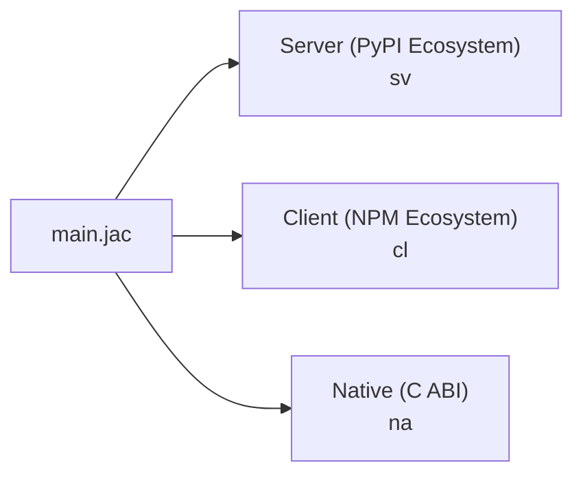
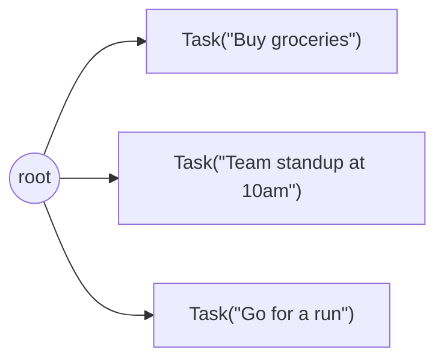

# Core Concepts

Most of Jac will be recognizable if you are familiar with another programming language like Python. Jac compiles to Python bytecode and shares many of its constructs, so functions, classes, imports, list comprehensions, and control flow all work as expected. You can explore those in depth in the [language reference](../reference/language/foundation.md).

This page focuses on the four concepts that Jac adds beyond traditional programming languages. These are the ideas the rest of the documentation builds on, introduced briefly so you have the vocabulary for the tutorials that follow. (For *why* the language is shaped this way, see [The Two Ideas](ideas-behind-jac.md).) Through these concepts four important questions can be answered:

1. [How can one language target frontend, backend, and native binaries at the same time?](#1-how-can-one-language-target-frontends-backends-and-native-binaries-at-the-same-time)
2. [How does Jac fully abstract away database organization and interactions and the complexity of multiuser persistent data?](#2-how-does-jac-fully-abstract-away-database-organization-and-interactions-and-the-complexity-of-multiuser-persistent-data)
3. [How does computation move to the data instead of data being fetched to the computation?](#3-how-does-computation-move-to-the-data-instead-of-data-being-fetched-to-the-computation)
4. [How does Jac abstract away the laborious task of prompt/context engineering for AI and turn it into a compiler/runtime problem?](#4-how-does-jac-abstract-away-the-laborious-task-of-promptcontext-engineering-for-ai-and-turn-it-into-a-compilerruntime-problem)

---

## The synechic surface

Questions 1 and 4 have one answer: the substrates that convention treats as separate worlds (the server, the browser, native code, and the LLM) are one continuous medium in Jac. This is the *synechic* side of the language, defined in [The Two Ideas](ideas-behind-jac.md#synechic).

### 1. How can one language target frontends, backends, and native binaries at the same time?

Similar to namespaces, the Jac language introduces the concept of **codespaces**. A Jac program can contain code that runs in different environments -- and you don't mark where each piece runs: the compiler derives it from what the code contains.



How inference decides:

- **JSX and npm imports are client signals.** A declaration containing JSX or a string-path npm import (`import from "react-dom" { ... }`) is client-only by construction, so the compiler places it in the client codespace automatically. Placement then propagates through references: helpers, `glob`s, and imports that client code uses join the client bundle too.
- **Extern C declarations are native signals.** An import whose braces declare C-ABI functions (`import from raylib { def InitWindow(w: i32, h: i32, title: str) -> None; }`) is an FFI surface only the native backend can satisfy, so the compiler places it -- and the declarations that use it -- in the native codespace automatically. Merely importing *from* a native module is not a native signal: that stays a server-side import, bridged by interop.
- **Everything else defaults to the server codespace** -- unmarked code compiles to Python, exactly as before.

Here's a file that spans two codespaces -- with no markers anywhere:

```jac
# Inferred server: plain data and logic, no client signals
node Todo {
    has title: str, done: bool = False;
}

def:pub add_todo(title: str) -> dict {
    todo = root ++> Todo(title=title);
    return {"id": jid(todo), "title": todo.title};
}

# Inferred client: the JSX in the body is a client signal
def:pub app -> JsxElement {
    has items: list = [];

    async def add -> None {
        todo = await add_todo("New");
        items = items + [todo];
    }

    return <div>
        <button onClick={lambda -> None { add(); }}>
            Add
        </button>
    </div>;
}
```

The compiler places `app` in the client codespace because its body contains JSX; `Todo` and `add_todo` stay on the server. The server definitions are visible to the client component -- and `def:pub` functions and walkers are never relocated by inference: they remain server endpoints, so when the client calls `add_todo(...)`, the compiler generates the HTTP call, serialization, and routing between codespaces. Likewise, a top-level `obj` referenced from both sides is shared across the boundary automatically. You write one language; the compiler produces the interop layer.

#### Explicit codespace markers

Inference can always be overridden. To pin code to a codespace -- or simply to make the split visible in the source -- you denote the codespace with a **braced block** (or **statement prefix**) inside a file, or with a **file extension**:

**Braced blocks** -- bracket a region of a file for one codespace:

- `sv { ... }` -- code inside the braces runs on the server (compiles to Python)
- `cl { ... }` -- code inside the braces runs in the browser (compiles to JavaScript)
- `na { ... }` -- code inside the braces compiles natively for the host machine (compiles to a native binary)
- Code outside any block is placed by inference (server unless it carries client signals). Blocks also work inside a function or class body.

**Single-statement prefixes** -- a prefix like `cl def foo() ...` tags one declaration for a codespace, handy for the occasional cross-codespace item in a file.

**File extensions** -- set the default top-level codespace for a file, e.g., for a module `prog`:

- `prog.sv.jac` -- top-level code defaults to server
- `prog.cl.jac` -- top-level code defaults to client
- `prog.na.jac` -- top-level code defaults to native
- `prog.jac` -- placement is inferred (server unless client or native signals say otherwise)

Any `.jac` file can still use all codespace forms regardless of its extension. The extension only changes what the default is for untagged code.

Three rules make the two styles interchangeable:

- **Markers always win.** Inference never moves anything tagged with a block, prefix, or extension -- the most useful pin is `sv` on a declaration you want kept server-side even though client code references it.
- **Native compatibility is not intent.** Extern C declarations infer native placement, but pure code that merely *could* compile natively stays on the server -- without an FFI seed, taking it native is your call, made via `na { }`, `.na.jac`, or `jac nacompile`.
- **The two styles compile identically.** A markerless file produces byte-identical output to its marker-annotated equivalent; the example above wrapped in an explicit `cl { ... }` block is the same program.

Codespaces are similar to namespaces, but instead of organizing names, they organize where code executes. Interop between them -- function calls, spawn calls, type sharing -- is handled by the compiler and runtime.

**The principle: placement is a modifier, not an architecture.** When the unit of tier assignment is the repository (a `frontend/` project and a `backend/` project), moving a function across the boundary is a rearchitecture. When it's a tag on a declaration, it's an edit. And because both sides are one program, one compiler sees both sides of every cross-tier call -- rename a field and every stale use, in every codespace, is a compile error rather than a runtime surprise. The continuity extends past tiers to **ecosystems**: each codespace is a first-class citizen of its host's package world (PyPI on the server, npm on the client, C libraries in native code), entered through an ordinary `import` rather than a wrapper you find, generate, or maintain.

!!! note "`obj` vs `class` -- choosing the right archetype"
    Cross-codespace interop requires the compiler to fully understand your type's structure. Jac's `obj` is designed for this: it enforces strict, declarative semantics -- fields declared with `has`, auto-generated constructors, no runtime monkey-patching -- so the same definition can compile to Python, JavaScript, or native code.

    If you need Python-specific class features like metaclasses, `@classmethod`, `@property`, or other decorator-heavy patterns, use a regular Python `class`. Those features are inherently tied to the Python runtime and cannot cross codespace boundaries. Jac provides the `static` keyword for static methods and fields, which covers the most common use case.

### 4. How does Jac abstract away the laborious task of prompt/context engineering for AI and turn it into a compiler/runtime problem?

Jac introduces Compiler-Integrated AI through its `by` and `sem` keywords. These two keywords allow integrating language models into programs at the language level rather than through library calls. They are the surface of Jac's [*meaning types*](../reference/plugins/byllm.md): the prompt is synthesized from your declarations, so delegating logic to a model is a typed language feature rather than string engineering.

#### `by`: delegate a function's implementation

```jac
enum Category { WORK, PERSONAL, SHOPPING, HEALTH, OTHER }

def categorize(title: str) -> Category
    by llm();
```

This function has no body. `by llm()` tells the compiler to delegate the implementation to a language model. The compiler extracts semantics from the code itself -- the function name, parameter names, types, and return type -- to construct the prompt. A well-named function like `categorize` with a typed parameter `title: str` and return type `Category` already communicates intent.

The return type is enforced. If the return type is an `enum`, the LLM can only produce one of its values. If it's an `obj`, every field must be filled. The type annotation serves as the output contract.

#### `sem`: attach semantics to bindings

The compiler can only infer so much from names and types. `sem` is the mechanism for providing additional semantic information beyond what exists in the code. It attaches a description to a specific variable binding that the compiler includes in the prompt:

```jac
obj Ingredient {
    has name: str;
    has cost: float;
    has carby: bool;
}

sem Ingredient.cost = "Estimated cost in USD";
sem Ingredient.carby = "True if this ingredient is high in carbohydrates";

def plan_shopping(recipe: str) -> list[Ingredient]
    by llm();
sem plan_shopping = "Generate a shopping list for the given recipe.";
```

Without `sem`, the LLM has only the names `cost` and `carby` to work with. With it, the compiler includes "Estimated cost in USD" and "True if this ingredient is high in carbohydrates" in the prompt, producing more accurate structured output. The `sem` on `plan_shopping` itself provides the function-level instruction.

`sem` is not a comment. It's a compiler directive that attaches semantic meaning to variable bindings -- fields, parameters, functions -- and changes what the LLM sees at runtime. It is the only way to convey intent beyond what the compiler can extract from the code and values in the program.

**The principle: the prompt is derived from the program, so it cannot drift.** A hand-written prompt template restates your types in English, and nothing checks the restatement -- rename a field and the prompt silently rots. Here the prompt is synthesized on every call from the current declarations, with the same fidelity a recompiled stub reflects a changed interface, and the declared return type is an enforced output contract: a delegated call either returns a value of its type or raises a typed error. Malformed model output never flows onward as corrupt data.

---

## The topokinetic core

Questions 2 and 3 have one answer: in Jac the data is a persistent *topology* of typed nodes and edges, and computation moves over it. This is the *topokinetic* side of the language, realized as Object-Spatial Programming and defined in [The Two Ideas](ideas-behind-jac.md#topokinetic).

### 2. How does Jac fully abstract away database organization and interactions and the complexity of multiuser persistent data?

Most languages store data in variables, objects, or database rows -- and you're responsible for the ORM, the schema, and the queries. Jac adds another option: **nodes** that live in a **graph**. You declare your data, connect it, and the runtime handles persistence automatically.

A `node` is declared like an `obj/class`, but with a superpower -- nodes can be connected to other nodes with **edges**, forming a graph:

```jac
node Task {
    has title: str;
    has done: bool = False;
}

with entry {
    # Create tasks and connect them to root
    root ++> Task(title="Buy groceries");
    root ++> Task(title="Team standup at 10am");
    root ++> Task(title="Go for a run");
}
```

The `++>` operator creates a node and connects it to an existing node with an edge. Your graph now looks like:



#### Persistence through `root`

Every Jac program has a built-in `root` node. Nodes reachable from `root` are **persistent** -- they survive process restarts. The runtime generates the storage schema from your node declarations automatically. No database setup, no ORM, no SQL.

When your app serves multiple users, each user gets their **own isolated `root`**. User A's tasks and User B's tasks live in completely separate graphs -- same code, isolated data, enforced by the runtime.

#### Querying the graph

The `[-->]` syntax gives you a list of connected nodes, and Jac's filter comprehensions `[?...]` let you narrow the results:

```jac
with entry {
    # Get all nodes connected from root as a list
    everything = [root-->];

    # Filter by node type
    tasks = [root-->][?:Task];

    # Filter by field value
    pending = [root-->][?:Task, done == False];
}
```

Edges can also be **typed** with their own data, modeling relationships like schedules, dependencies, or social connections:

```jac
edge Scheduled {
    has time: str;
    has priority: int = 1;
}

with entry {
    root +>: Scheduled(time="9:00am", priority=3) :+> Task(title="Morning run");

    # Query through typed edges
    urgent = [root->:Scheduled:priority>=3:->][?:Task];
}
```

The key insight: instead of designing database tables and writing queries, you declare nodes and connect them. The graph **is** your data model, and `root` is the entry point. The runtime takes care of the rest.

**The principle: persistence is a predicate, not an event.** In the I/O conception, persistence is something the program *does* at a moment -- and forgetting to do it is a bug. Here, a datum is durable exactly while it stands in a reachable position: attaching a node with `++>` confers durability, severing its last path to `root` revokes it, and no statement in between maintains it. It's the same rule garbage collection uses for liveness, pointed at the future instead of the past. And because each user's data hangs from their own `root`, isolation isn't tenancy code you write -- it's the shape of the graph. Sharing across users is the act that takes explicit code (`grant`), not the accident that happens when a filter is missing.

---

### 3. How does computation move to the data instead of data being fetched to the computation?

Every mainstream language inherits a convention older than the field: the site of computation is fixed, and data is delivered to it -- from the database to the application server, from the API to the client, from the vector store to the prompt. Jac adds the inverse as a first-class construct. A **walker** is mobile computation: a typed object that travels through the graph, carrying its own state, running code on arrival.

```jac
node Task {
    has title: str;
    has done: bool = False;
}

walker complete_all {
    has count: int = 0;

    can start with Root entry {
        visit [-->[?:Task]];         # queue every Task connected to root
    }
    can mark with Task entry {
        here.done = True;            # `here` is the node under the walker
        self.count += 1;             # `self` is the walker itself
    }
    can summary with Root exit {
        report f"completed {self.count} tasks";
    }
}

with entry {
    root ++> Task(title="write docs");
    root ++> Task(title="ship release");
    result = root spawn complete_all();
    print(result.reports[0]);        # completed 2 tasks
}
```

The dispatch model is the interesting part: nobody *calls* `mark`. It runs because a `complete_all` walker **arrived** at a `Task` node -- the runtime matches the walker's type against the node's type and runs whatever either side declared for that encounter (nodes can declare abilities for visiting walker types too). Dispatch by arrival, not by invocation.

Three habits shift when you program this way:

1. **Relationships stop being encodings.** No foreign-key columns or join tables -- you draw a typed edge, and the diagram you'd sketch on a whiteboard *is* the data model.
2. **Queries become paths.** "Every task scheduled after 9am" is not a join to compose but a route to name: `[root->:Scheduled:time>"9:00am":->]`.
3. **Algorithms become itineraries.** Instead of a procedure that branches on what it holds, a walker's abilities say what to do at each kind of place, and arrival does the dispatch.

This composes with the previous two concepts to produce Jac's signature moves. Because the graph persists (concept 2), a walker's world outlives the process -- which is why an **AI agent's memory** in Jac is just a topology hung from `root`, where remembering is walking and context assembly is path selection instead of vector-store glue. And because a walker's `has` fields fully describe its inputs and its `report`s describe its outputs, marking one `:pub` makes `jac start` serve it as a REST endpoint with no route table -- the declaration *is* the interface. [Object-Spatial Programming tutorial →](../tutorials/language/osp.md)

---

## How the Four Concepts Relate

The four concepts are the two properties, seen from the builder's side:

- **Codespaces** and **`by`/`sem`** are the *synechic* surface: one language spans server, client, native code, and the model, and one compiler checks every crossing.
- **Graphs and `root`** and **walkers** are the *topokinetic* core: the data is a persistent topology, computation travels over it, and whatever is reachable from `root` persists.

In practice they compose: walkers traverse a persistent graph on the server, delegate decisions to an LLM via `by llm()`, and the results render in a client-side UI, all within one language, checked by one compiler. The composition is the point. With continuity and motion together, the database stops existing as a separate system ([the two ideas compound](ideas-behind-jac.md#the-two-ideas-compound)).

---

## Quick Reference

| Syntax | Meaning |
|--------|---------|
| `sv { }` | Server codespace block |
| `cl { }` | Client codespace block |
| `na { }` | Native codespace block |
| `node X { has ...; }` | Declare a graph data type |
| `root` | Built-in starting node (persistence anchor) |
| `a ++> b` | Connect node `a` to node `b` |
| `[a -->]` | Get all nodes connected from `a` |
| `walker W { }` | Declare mobile computation |
| `visit [-->]` | Move walker to connected nodes |
| `by llm()` | Delegate function body to an LLM |
| `sem X.field = "..."` | Semantic hint for AI understanding |

---

## Next Steps

- [The Two Ideas](ideas-behind-jac.md): why the language is shaped this way
- [One App, Two Stacks](jac-vs-traditional-stack.md): side-by-side comparison with a traditional stack
- [Build an AI Day Planner](../tutorials/first-app/build-ai-day-planner.md): apply these concepts in a working app
- [Object-Spatial Programming](../tutorials/language/osp.md): full tutorial on nodes, edges, and walkers
- [byLLM Quickstart](../tutorials/ai/quickstart.md): build an AI-integrated function
