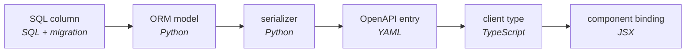

# Why Jac Exists

Modern software development has fragmented into a patchwork of languages,
package ecosystems, and configuration dialects. Consider the stack a competent
team assembles today for an ordinary product: a React frontend, a Python API, a
relational database, a cache, a task queue, an LLM feature, containers, CI, and
infrastructure-as-code. Count the notations a maintainer must read: four
languages where logic lives (TypeScript, Python, SQL, shell), two presentation
notations (JSX, CSS), and six configuration dialects (JSON, TOML, three
unrelated YAML schemas, Dockerfile, HCL, dotenv). That is twelve notations and
five package ecosystems, each ecosystem with its own resolver and its own
advisory feed. Nobody chose this. It is what precipitates when every
architectural seam is also a change of language, type system, and serialization
regime.

The number that matters more is harder to see: the count of places where
meaning is re-encoded with no tool checking the encoding. We call such a place
a *discontinuity*: a boundary at which the representation of meaning must
change and over which no verifier has jurisdiction. We call what
discontinuities cost *glue*: code or configuration whose sole purpose is to
carry meaning across a discontinuity, adding no domain behavior of its own. For
example, the ORM model restates the SQL schema, the Pydantic schema restates
the ORM model, the TypeScript interface restates the Pydantic schema, the route
table names functions a second time in URL vocabulary, and the prompt template
restates your types in English. Every one of those restatements is glue, and
every one sits on a discontinuity.

The diagram below traces the path one value walks from its source of truth to
the pixels that render it:

Five dialects, three hand-authored representation changes, and not one pair of
adjacent boxes that any verifier spans. Within TypeScript's territory, a
renamed field is a build error at every stale use. Between territories there is
nothing: the whole-program type checker of the modern stack is `grep`. Note
that defects do not distribute evenly across a codebase. They pool at the
discontinuities, because a discontinuity is by definition a place where the
machinery that prevents defects has no reach.

---

## Two assumptions, seventy years old

This fragmentation is not required, and the case comes in two parts.

First, none of it is required by modularity. Modules need boundaries and
interfaces. Nothing requires that a boundary also be a change of language, type
system, package ecosystem, serialization regime, and deployment unit all at
once. The conventional stack bundles one good idea (decomposition) with five
contingent ones and sells them as a package.

Second, none of it is required by computation. The pattern traces to the 1945
report that defined the stored-program computer, and to two silent assumptions
latent in its picture of a machine. The first assumption is that *computation
is stationary*: the site of processing is fixed, and data travels to it, from
memory to processor, and by later extension from disk to memory, from database
to application, from server to client. The second assumption is that *the
machine is the program's world*: a program's semantics extend exactly to the
edge of its memory and no further, so frontend and backend, managed and
native, script and service are separate programs, joined by hand. Neither
assumption is a law of computation. Both are engineering defaults from a
report about a machine with one memory, and seventy years of habit made them
look like laws.

Jac is one bet against each assumption. Discarding the second gives a language
that presents one continuous, checked medium across every substrate an
application touches; that property is named *synechic*. Discarding the first
gives a language in which computation moves through the shape of its data;
that property is named *topokinetic*. [The Two Ideas](ideas-behind-jac.md)
defines both and states why they compound.

---

## Why this matters more in the era of AI authorship

Coding models now write a large share of new code, and this tempts a shortcut:
if machines can emit the four copies of a record in seconds, the copies look
free. The inference fails three ways.

First, glue is the most mechanically derivable text in software, and it
dominates the corpora the models learned from. A generator of code is, before
anything else, a generator of glue. Second, glue's cost was never the typing.
The cost is verification. Discontinuities are precisely the program points no
tool can check, so cheap generation against fixed verification cost moves the
bottleneck: ten times the glue is ten times the unverifiable surface, and a
fluent model drifts more plausibly than a tired human. Third, every generated
serializer and manifest returns to the training corpus as evidence that this
is what software is.

A continuous medium changes the terms for human and machine authors at once.
A whole Jac application fits in one file that fits in a context window. Every
cross-tier invariant is a compile-time property, so an agent's mistake is a
diagnostic, not a production incident. A `sem` annotation is read three ways:
by the prompt synthesizer as specification, by the maintainer as
documentation, and by the coding agent as context.

When authorship is abundant, the scarce resource is *jurisdiction*: the reach
of the verifiers that can examine a change and say no. A language is where
that reach is decided. Discontinuities that were tolerable when humans wrote
software are untenable when machines do, and Jac is built to leave no program
point where the only reviewer is hope.

---

## Next steps

- [The Two Ideas](ideas-behind-jac.md): the two properties the diagnosis
  forces, defined precisely
- [One App, Two Stacks](jac-vs-traditional-stack.md): the same argument, made
  by building one app both ways and counting
- [Core Concepts](what-makes-jac-different.md): the practical tour of the
  language these ideas produce
