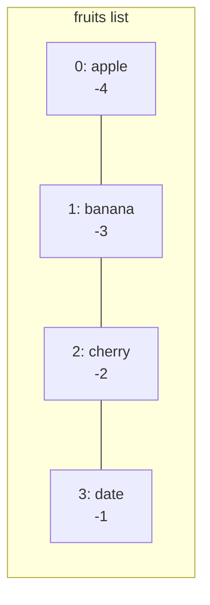

# The Complete Beginner's Guide to Programming with Jac

> **Welcome to Programming!** This guide will teach you how to program using Jac as your first programming language. No prior experience required. We'll start from the absolute basics and build up to advanced concepts step by step.

---

## Table of Contents

1. [Introduction: What is Programming?](#1-introduction-what-is-programming)
2. [Setting Up: Your First Program](#2-setting-up-your-first-program)
3. [The Basics: Variables and Data](#3-the-basics-variables-and-data)
4. [Making Decisions: Control Flow](#4-making-decisions-control-flow)
5. [Repeating Actions: Loops](#5-repeating-actions-loops)
6. [Organizing Code: Functions](#6-organizing-code-functions)
7. [Collections: Working with Multiple Values](#7-collections-working-with-multiple-values)
8. [Grouping Things: Classes and Objects](#8-grouping-things-classes-and-objects)
9. [Where to Go Next](#where-to-go-next)

---

## 1. Introduction: What is Programming?

Programming is giving instructions to a computer. Just like you might give directions to a friend ("turn left, then go straight"), you give instructions to a computer using a programming language.

### Why Jac?

Jac is special because it teaches you **two ways of thinking**:

1. **Traditional Programming** - Like most languages (Python, JavaScript, Java)
2. **Object-Spatial Programming (OSP)** - A new way to think about how data and computation work together

Think of it this way:

- **Traditional Programming**: You call a restaurant and order food to be delivered to you
- **Object-Spatial Programming**: You send a robot to visit different restaurants and collect food

Both get you fed, but they work differently! This guide teaches you the first: the programming fundamentals every language shares. Once you have those, [Object-Spatial Programming](osp.md) teaches you the second.

---

## 2. Setting Up: Your First Program

Every Jac program needs a place to start. We use a special block called `with entry`:

<div class="code-block">

```jac
with entry {
    print("Hello, World!");
}
```

</div>

**What's happening here?**

- `with entry` - This is where your program starts
- `print()` - This is a **function** that displays text on the screen
- `"Hello, World!"` - This is text (called a **string**)
- `;` - Every instruction ends with a semicolon
- `{}` - Curly braces group instructions together

**Try it yourself:** Change "Hello, World!" to your name!

<div class="code-block">

```jac
with entry {
    print("Hello, my name is Alice!");
}
```

</div>

---

## 3. The Basics: Variables and Data

### 3.1 What is a Variable?

A variable is like a labeled box where you store information. You give it a name, and you can put different things in it.

<div class="code-block">

```jac
with entry {
    # Create a variable
    name = "Alice";
    age = 25;
    height = 5.6;

    print(name);    # Shows: Alice
    print(age);     # Shows: 25
}
```

</div>

**Lines starting with `#` are comments** - they're notes for humans, the computer ignores them.

### 3.2 Types of Data

Just like in real life, data comes in different types:

#### Text (Strings)

<div class="code-block">

```jac
with entry {
    greeting = "Hello";
    name = "Bob";
    message = "Welcome to Jac!";

    print(greeting);  # Shows: Hello
}
```

</div>

Strings go inside quotes: `"like this"` or `'like this'`

#### Numbers (Integers)

<div class="code-block">

```jac
with entry {
    apples = 5;
    students = 30;
    year = 2024;

    print(apples);  # Shows: 5
}
```

</div>

Whole numbers with no decimal point.

#### Numbers (Floats)

<div class="code-block">

```jac
with entry {
    temperature = 72.5;
    price = 19.99;
    pi = 3.14159;

    print(temperature);  # Shows: 72.5
}
```

</div>

Numbers with decimal points.

#### True or False (Booleans)

<div class="code-block">

```jac
with entry {
    is_raining = True;
    is_sunny = False;

    print(is_raining);  # Shows: True
}
```

</div>

Only two values: `True` or `False` (notice the capital letters!)

### 3.3 Type Annotations (Recommended!)

You can tell Jac what type of data a variable should hold:

<div class="code-block">

```jac
with entry {
    name: str = "Alice";      # str means string (text)
    age: int = 25;            # int means integer (whole number)
    height: float = 5.6;      # float means decimal number
    is_student: bool = True;  # bool means boolean (True/False)

    print(f"{name} is {age} years old");
}
```

</div>

**Pro tip:** The `f` before a string lets you insert variables using `{variable_name}`

### 3.4 Doing Math

You can calculate with numbers:

<div class="code-block">

```jac
with entry {
    # Basic math
    sum = 5 + 3;        # Addition: 8
    difference = 10 - 4; # Subtraction: 6
    product = 6 * 7;     # Multiplication: 42
    quotient = 20 / 4;   # Division: 5.0

    print(sum);         # Shows: 8
    print(product);     # Shows: 42

    # More operations
    remainder = 17 % 5;  # Modulo (remainder): 2
    power = 2 ** 3;      # Exponent: 8 (2³)

    # Combined operations
    total = (5 + 3) * 2;  # Use parentheses like in math: 16

    print(total);
}
```

</div>

### 3.5 Changing Variables

Variables can change their value:

<div class="code-block">

```jac
with entry {
    score = 0;
    print(score);    # Shows: 0

    score = 10;
    print(score);    # Shows: 10

    score = score + 5;  # Add 5 to current value
    print(score);    # Shows: 15

    # Shortcut for score = score + 5
    score += 5;
    print(score);    # Shows: 20
}
```

</div>

**Common shortcuts:**

- `x += 5` means `x = x + 5` (add 5)
- `x -= 3` means `x = x - 3` (subtract 3)
- `x *= 2` means `x = x * 2` (multiply by 2)
- `x /= 4` means `x = x / 4` (divide by 4)

### 3.6 Practice Exercise

**Challenge:** Create a program that calculates the area of a rectangle.

<div class="code-block">

```jac
with entry {
    # Write your code here
    width: float = 5.0;
    height: float = 3.0;

    area = width * height;

    print(f"The area is {area}");
}
```

</div>

---

## 4. Making Decisions: Control Flow

Programs need to make decisions based on conditions. This is where `if`, `elif`, and `else` come in.

### 4.1 The If Statement

<div class="code-block">

```jac
with entry {
    age = 18;

    if age >= 18 {
        print("You are an adult");
    }
}
```

</div>

**How it works:**

- `if age >= 18` - Check if age is greater than or equal to 18
- If the condition is `True`, run the code inside `{}`
- If the condition is `False`, skip the code inside `{}`

### 4.2 Comparison Operators

These let you compare values:

| Operator | Meaning | Example |
|----------|---------|---------|
| `>` | Greater than | `x > 5` |
| `<` | Less than | `x < 10` |
| `>=` | Greater than or equal | `age >= 18` |
| `<=` | Less than or equal | `score <= 100` |
| `==` | Equal to | `name == "Alice"` |
| `!=` | Not equal to | `status != "done"` |

**Important:** Use `==` to compare (not `=`). Use `=` to assign values!

### 4.3 If-Else

What if you want to do something when the condition is `False`?

<div class="code-block">

```jac
with entry {
    temperature = 72;

    if temperature > 75 {
        print("It's hot outside!");
    } else {
        print("It's nice outside!");
    }
}
```

</div>

### 4.4 If-Elif-Else

What about multiple conditions?

<div class="code-block">

```jac
with entry {
    score = 85;

    if score >= 90 {
        print("Grade: A");
    } elif score >= 80 {
        print("Grade: B");
    } elif score >= 70 {
        print("Grade: C");
    } elif score >= 60 {
        print("Grade: D");
    } else {
        print("Grade: F");
    }
}
```

</div>

**How it works:**

1. Check first `if` - if `True`, run its code and skip the rest
2. If first is `False`, check first `elif`
3. Keep checking until one is `True`
4. If none are `True`, run `else` block

### 4.5 Combining Conditions

You can combine multiple conditions:

<div class="code-block">

```jac
with entry {
    age = 25;
    has_license = True;

    # AND - both must be true
    if age >= 16 and has_license {
        print("You can drive!");
    }

    # OR - at least one must be true
    if age < 18 or age > 65 {
        print("Discounted ticket price!");
    }

    # NOT - reverse the condition
    if not has_license {
        print("You need a license!");
    }
}
```

</div>

### 4.6 Nested Ifs

You can put `if` statements inside other `if` statements:

<div class="code-block">

```jac
with entry {
    weather = "sunny";
    temperature = 80;

    if weather == "sunny" {
        if temperature > 75 {
            print("Perfect beach day!");
        } else {
            print("Nice day for a walk!");
        }
    } else {
        print("Maybe stay inside");
    }
}
```

</div>

### 4.7 Practice Exercise

**Challenge:** Write a program that checks if someone is a child (0-12), teenager (13-19), adult (20-64), or senior (65+).

<div class="code-block">

```jac
with entry {
    age = 17;

    # Your code here
    if age <= 12 {
        print("Child");
    } elif age <= 19 {
        print("Teenager");
    } elif age <= 64 {
        print("Adult");
    } else {
        print("Senior");
    }
}
```

</div>

---

## 5. Repeating Actions: Loops

Loops let you repeat code multiple times without writing it over and over.

### 5.1 The While Loop

Repeat code while a condition is `True`:

<div class="code-block">

```jac
with entry {
    count = 1;

    while count <= 5 {
        print(f"Count is {count}");
        count += 1;  # IMPORTANT: Change the variable or loop forever!
    }

    print("Done!");
}
```

</div>

**Warning:** Make sure your condition eventually becomes `False`, or your loop will run forever!

### 5.2 The For Loop (Counting)

When you know exactly how many times to repeat:

<div class="code-block">

```jac
with entry {
    # Count from 0 to 4
    for i = 0 while i < 5 with i += 1 {
        print(f"Number: {i}");
    }
}
```

</div>

**Breaking it down:**

- `i = 0` - Start at 0
- `i < 5` - Continue while i is less than 5
- `i += 1` - Add 1 to i each time

### 5.3 The For-In Loop (Iterating)

Loop through items in a collection:

<div class="code-block">

```jac
with entry {
    # We'll learn about lists soon!
    fruits = ["apple", "banana", "cherry"];

    for fruit in fruits {
        print(f"I like {fruit}");
    }
}
```

</div>

### 5.4 Breaking Out of Loops

Sometimes you want to stop a loop early:

<div class="code-block">

```jac
with entry {
    # Find first number divisible by 7
    for i = 1 while i <= 100 with i += 1 {
        if i % 7 == 0 {
            print(f"Found it: {i}");
            break;  # Exit the loop immediately
        }
    }
}
```

</div>

### 5.5 Skipping Iterations

Skip to the next iteration without running the rest of the loop body:

<div class="code-block">

```jac
with entry {
    # Print only odd numbers
    for i = 1 while i <= 10 with i += 1 {
        if i % 2 == 0 {
            continue;  # Skip even numbers
        }
        print(i);
    }
}
```

</div>

### 5.6 Practice Exercises

**Challenge 1:** Write a loop that prints all multiples of 3 from 3 to 30.

<div class="code-block">

```jac
with entry {
    for i = 3 while i <= 30 with i += 3 {
        print(i);
    }
}
```

</div>

**Challenge 2:** Write a countdown from 10 to 1, then print "Blast off!"

<div class="code-block">

```jac
with entry {
    count = 10;
    while count > 0 {
        print(count);
        count -= 1;
    }
    print("Blast off!");
}
```

</div>

---

## 6. Organizing Code: Functions

Functions are reusable blocks of code that do specific tasks. Think of them as mini-programs within your program.

### 6.1 Creating Your First Function

<div class="code-block">

```jac
# Define the function
def greet {
    print("Hello, there!");
}

with entry {
    # Use (call) the function
    greet();
    greet();
    greet();
}
```

</div>

### 6.2 Functions with Parameters

Make functions more flexible by giving them inputs:

<div class="code-block">

```jac
def greet(name: str) {
    print(f"Hello, {name}!");
}

with entry {
    greet("Alice");
    greet("Bob");
    greet("Charlie");
}
```

</div>

**Breaking it down:**

- `name: str` - This is a **parameter** (input)
- `: str` - Type annotation (optional but recommended)
- When you call `greet("Alice")`, `"Alice"` becomes the value of `name`

### 6.3 Multiple Parameters

Functions can take multiple inputs:

<div class="code-block">

```jac
def add(x: int, y: int) {
    sum = x + y;
    print(f"{x} + {y} = {sum}");
}

with entry {
    add(5, 3);
    add(10, 20);
}
```

</div>

### 6.4 Returning Values

Instead of just printing, functions can send values back:

<div class="code-block">

```jac
def add(x: int, y: int) -> int {
    return x + y;
}

with entry {
    result = add(5, 3);
    print(result);  # Shows: 8

    # Use directly in calculations
    total = add(10, 20) + add(5, 5);
    print(total);  # Shows: 40
}
```

</div>

**Breaking it down:**

- `-> int` - This function returns an integer
- `return x + y;` - Send this value back to whoever called the function
- The returned value can be stored in a variable or used directly

### 6.5 Default Parameters

Give parameters default values:

<div class="code-block">

```jac
def greet(name: str = "friend", excited: bool = False) {
    if excited {
        print(f"HELLO, {name}!!!");
    } else {
        print(f"Hello, {name}.");
    }
}

with entry {
    greet();                          # Uses defaults
    greet("Alice");                   # Uses name, default excited
    greet("Bob", True);               # Both specified
    greet(excited=True, name="Eve");  # Named parameters
}
```

</div>

### 6.6 Why Use Functions?

**1. Avoid Repetition**

Bad:
<div class="code-block">

```jac
with entry {
    print("Welcome!");
    print("Please enter your name.");
    # ... 20 more lines ...

    # Later in code...
    print("Welcome!");
    print("Please enter your name.");
    # ... same 20 lines again ...
}
```

</div>

Good:
<div class="code-block">

```jac
def show_welcome {
    print("Welcome!");
    print("Please enter your name.");
    # ... 20 more lines ...
}

with entry {
    show_welcome();
    # ... later ...
    show_welcome();
}
```

</div>

**2. Break Down Complex Problems**

<div class="code-block">

```jac
def calculate_area(width: float, height: float) -> float {
    return width * height;
}

def calculate_perimeter(width: float, height: float) -> float {
    return 2 * (width + height);
}

def describe_rectangle(width: float, height: float) {
    area = calculate_area(width, height);
    perimeter = calculate_perimeter(width, height);

    print(f"Rectangle: {width} x {height}");
    print(f"Area: {area}");
    print(f"Perimeter: {perimeter}");
}

with entry {
    describe_rectangle(5.0, 3.0);
}
```

</div>

### 6.7 Practice Exercises

**Challenge 1:** Write a function that checks if a number is even.

<div class="code-block">

```jac
def is_even(num: int) -> bool {
    return num % 2 == 0;
}

with entry {
    print(is_even(4));   # True
    print(is_even(7));   # False
}
```

</div>

**Challenge 2:** Write a function that finds the maximum of two numbers.

<div class="code-block">

```jac
def max(a: int, b: int) -> int {
    if a > b {
        return a;
    } else {
        return b;
    }
}

with entry {
    print(max(10, 5));   # 10
    print(max(3, 8));    # 8
}
```

</div>

---

## 7. Collections: Working with Multiple Values

So far, we've stored single values in variables. But what if you want to store multiple related values?

### 7.1 Lists - Ordered Collections

Lists hold multiple values in order:

<div class="code-block">

```jac
with entry {
    # Create a list
    fruits = ["apple", "banana", "cherry"];

    print(fruits);  # ['apple', 'banana', 'cherry']
}
```

</div>

### 7.2 Accessing List Items

Each item has an index (position), starting at 0:

<div class="code-block">

```jac
with entry {
    fruits = ["apple", "banana", "cherry", "date"];

    print(fruits[0]);   # apple (first item)
    print(fruits[1]);   # banana (second item)
    print(fruits[3]);   # date (fourth item)

    # Negative indices count from the end
    print(fruits[-1]);  # date (last item)
    print(fruits[-2]);  # cherry (second to last)
}
```

</div>

**Visual:**



### 7.3 Modifying Lists

<div class="code-block">

```jac
with entry {
    numbers = [1, 2, 3];

    # Change an item
    numbers[1] = 99;
    print(numbers);  # [1, 99, 3]

    # Add to end
    numbers.append(4);
    print(numbers);  # [1, 99, 3, 4]

    # Insert at position
    numbers.insert(0, 0);  # Insert 0 at index 0
    print(numbers);  # [0, 1, 99, 3, 4]

    # Remove by value
    numbers.remove(99);
    print(numbers);  # [0, 1, 3, 4]

    # Remove by index
    numbers.pop(0);  # Remove first item
    print(numbers);  # [1, 3, 4]
}
```

</div>

### 7.4 List Operations

<div class="code-block">

```jac
with entry {
    numbers = [1, 2, 3];

    # Length
    print(len(numbers));  # 3

    # Concatenation
    more_numbers = numbers + [4, 5];
    print(more_numbers);  # [1, 2, 3, 4, 5]

    # Repetition
    repeated = [0] * 5;
    print(repeated);  # [0, 0, 0, 0, 0]

    # Membership
    if 2 in numbers {
        print("Found 2!");
    }
}
```

</div>

### 7.5 Looping Through Lists

<div class="code-block">

```jac
with entry {
    fruits = ["apple", "banana", "cherry"];

    # Loop through items
    for fruit in fruits {
        print(f"I like {fruit}");
    }

    # Loop with index
    for i = 0 while i < len(fruits) with i += 1 {
        print(f"{i}: {fruits[i]}");
    }
}
```

</div>

### 7.6 List Slicing

Get a portion of a list:

<div class="code-block">

```jac
with entry {
    numbers = [0, 1, 2, 3, 4, 5, 6, 7, 8, 9];

    # [start:end] - start is included, end is excluded
    print(numbers[2:5]);   # [2, 3, 4]

    # [:end] - from beginning to end
    print(numbers[:3]);    # [0, 1, 2]

    # [start:] - from start to end of list
    print(numbers[7:]);    # [7, 8, 9]

    # [start:end:step] - with step size
    print(numbers[0:9:2]); # [0, 2, 4, 6, 8]
}
```

</div>

### 7.7 Dictionaries - Key-Value Pairs

Dictionaries store data as key-value pairs:

<div class="code-block">

```jac
with entry {
    # Create a dictionary
    person = {
        "name": "Alice",
        "age": 25,
        "city": "Seattle"
    };

    # Access values by key
    print(person["name"]);  # Alice
    print(person["age"]);   # 25

    # Add or modify
    person["job"] = "Engineer";
    person["age"] = 26;

    print(person);
}
```

</div>

### 7.8 Looping Through Dictionaries

<div class="code-block">

```jac
with entry {
    scores = {
        "Alice": 95,
        "Bob": 87,
        "Charlie": 92
    };

    # Loop through keys
    for name in scores {
        print(f"{name}: {scores[name]}");
    }
}
```

</div>

### 7.9 Tuples - Immutable Lists

Tuples are like lists, but they can't be changed after creation:

<div class="code-block">

```jac
with entry {
    # Create a tuple
    point = (10, 20);

    # Access like a list
    print(point[0]);  # 10
    print(point[1]);  # 20

    # Unpack into variables
    (x, y) = point;
    print(f"x={x}, y={y}");

    # Can't modify!
    # point[0] = 5;  # ERROR!
}
```

</div>

### 7.10 List Comprehensions - Powerful Shortcuts

Create lists in one line:

<div class="code-block">

```jac
with entry {
    # Traditional way
    squares = [];
    for i = 0 while i < 5 with i += 1 {
        squares.append(i ** 2);
    }
    print(squares);  # [0, 1, 4, 9, 16]

    # List comprehension way
    squares = [i ** 2 for i in range(5)];
    print(squares);  # [0, 1, 4, 9, 16]

    # With condition
    evens = [i for i in range(10) if i % 2 == 0];
    print(evens);  # [0, 2, 4, 6, 8]
}
```

</div>

### 7.11 Practice Exercises

**Challenge 1:** Create a list of your 5 favorite foods and print each one.

**Challenge 2:** Create a dictionary of 3 people with their ages, then print the oldest person.

<div class="code-block">

```jac
with entry {
    ages = {"Alice": 25, "Bob": 30, "Charlie": 22};

    oldest_name = "";
    oldest_age = 0;

    for name in ages {
        if ages[name] > oldest_age {
            oldest_age = ages[name];
            oldest_name = name;
        }
    }

    print(f"{oldest_name} is the oldest at {oldest_age}");
}
```

</div>

---

## 8. Grouping Things: Classes and Objects

Classes let you create your own custom types that bundle data and functions together.

### 8.1 What is a Class?

Think of a class as a blueprint for creating objects.

**Real-world analogy:**

- **Class**: Blueprint for a car (defines what all cars have)
- **Object**: An actual car (a specific instance)

### 8.2 Creating Your First Class

<div class="code-block">

```jac
# Define the class (blueprint)
class Dog {
    has name: str = "Unnamed";
    has age: int = 0;

    def bark {
        print(f"{self.name} says Woof!");
    }
}

with entry {
    # Create objects (instances)
    my_dog = Dog();
    my_dog.name = "Buddy";
    my_dog.age = 3;

    your_dog = Dog();
    your_dog.name = "Max";
    your_dog.age = 5;

    # Use the objects
    my_dog.bark();   # Buddy says Woof!
    your_dog.bark(); # Max says Woof!

    print(f"{my_dog.name} is {my_dog.age} years old");
}
```

</div>

**Breaking it down:**

- `class Dog` - Define a new type called Dog
- `has name: str` - Every Dog has a name (property/attribute)
- `def bark` - Every Dog can bark (method)
- `self` - Refers to the current object
- `Dog()` - Create a new Dog object

### 8.3 Constructors - Setting Initial Values

Objects are automatically initialized with their `has` attributes as parameters:

<div class="code-block">

```jac
obj Dog {
    has name: str;
    has age: int;

    def bark {
        print(f"{self.name} says Woof!");
    }

    def birthday {
        self.age += 1;
        print(f"Happy birthday! {self.name} is now {self.age}");
    }
}

with entry {
    my_dog = Dog(name="Buddy", age=3);
    my_dog.bark();
    my_dog.birthday();
}
```

</div>

### 8.4 Why Use Classes?

**1. Group Related Data**

Instead of:
<div class="code-block">

```jac
with entry {
    dog1_name = "Buddy";
    dog1_age = 3;
    dog1_breed = "Labrador";

    dog2_name = "Max";
    dog2_age = 5;
    dog2_breed = "Poodle";

    print(f"Dog 1: {dog1_name}, {dog1_age}, {dog1_breed}");
    print(f"Dog 2: {dog2_name}, {dog2_age}, {dog2_breed}");
}
```

</div>

Use:
<div class="code-block">

```jac
obj Dog {
    has name: str;
    has age: int;
    has breed: str;
}

with entry {
    dog1 = Dog(name="Buddy", age=3, breed="Labrador");
    dog2 = Dog(name="Max", age=5, breed="Poodle");

    print(f"Dog 1: {dog1.name}, {dog1.age}, {dog1.breed}");
    print(f"Dog 2: {dog2.name}, {dog2.age}, {dog2.breed}");
}
```

</div>

**2. Bundle Data with Behavior**

<div class="code-block">

```jac
obj BankAccount {
    has balance: float = 0.0;

    def deposit(amount: float) {
        self.balance += amount;
        print(f"Deposited ${amount}. New balance: ${self.balance}");
    }

    def withdraw(amount: float) {
        if amount <= self.balance {
            self.balance -= amount;
            print(f"Withdrew ${amount}. New balance: ${self.balance}");
        } else {
            print("Insufficient funds!");
        }
    }
}

with entry {
    account = BankAccount();
    account.deposit(100.0);
    account.withdraw(30.0);
    account.withdraw(80.0);  # Insufficient funds!
}
```

</div>

### 8.5 Inheritance - Building on Existing Classes

Create specialized versions of classes:

<div class="code-block">

```jac
# Base object
obj Animal {
    has name: str;
    has age: int;

    def speak {
        print(f"{self.name} makes a sound");
    }
}

# Specialized object
obj Dog(Animal) {  # Dog inherits from Animal
    has breed: str;

    # Override parent method
    def speak {
        print(f"{self.name} barks: Woof!");
    }

    # New method specific to Dog
    def fetch {
        print(f"{self.name} fetches the ball!");
    }
}

obj Cat(Animal) {
    # Override parent method
    def speak {
        print(f"{self.name} meows: Meow!");
    }
}

with entry {
    dog = Dog(name="Buddy", age=3, breed="Labrador");
    cat = Cat(name="Whiskers", age=2);

    dog.speak();  # Buddy barks: Woof!
    cat.speak();  # Whiskers meows: Meow!

    dog.fetch();  # Buddy fetches the ball!
}
```

</div>

**Inheritance lets you:**

- Reuse code from parent classes
- Create specialized versions
- Override methods for custom behavior
- Add new methods to specialized classes

### 8.6 Real Example: A Simple Game Character

<div class="code-block">

```jac
obj Character {
    has name: str;
    has health: int = 100;
    has strength: int = 10;

    def attack(target: Character) {
        damage = self.strength;
        print(f"{self.name} attacks {target.name} for {damage} damage!");
        target.take_damage(damage);
    }

    def take_damage(amount: int) {
        self.health -= amount;
        print(f"{self.name} has {self.health} health remaining");

        if self.health <= 0 {
            print(f"{self.name} has been defeated!");
        }
    }
}

obj Warrior(Character) {
    def postinit {
        self.strength = 20;  # Warriors hit harder
    }
}

obj Mage(Character) {
    def postinit {
        self.strength = 15;
    }

    def cast_spell(target: Character) {
        damage = self.strength * 2;  # Spells do double damage
        print(f"{self.name} casts fireball at {target.name} for {damage} damage!");
        target.take_damage(damage);
    }
}

with entry {
    warrior = Warrior(name="Conan");
    mage = Mage(name="Gandalf");

    warrior.attack(mage);
    mage.cast_spell(warrior);
}
```

</div>

### 8.7 Practice Exercises

**Challenge 1:** Create a `Rectangle` class with width and height, and methods to calculate area and perimeter.

<div class="code-block">

```jac
obj Rectangle {
    has width: float;
    has height: float;

    def area -> float {
        return self.width * self.height;
    }

    def perimeter -> float {
        return 2 * (self.width + self.height);
    }
}

with entry {
    rect = Rectangle(width=5.0, height=3.0);
    print(f"Area: {rect.area()}");
    print(f"Perimeter: {rect.perimeter()}");
}
```

</div>

**Challenge 2:** Create a `Student` class with name and a list of grades, plus a method to calculate average grade.

<div class="code-block">

```jac
obj Student {
    has name: str;
    has grades: list = [];

    def add_grade(grade: int) {
        self.grades.append(grade);
    }

    def average -> float {
        if len(self.grades) == 0 {
            return 0.0;
        }
        return sum(self.grades) / len(self.grades);
    }
}

with entry {
    student = Student(name="Alice");
    student.add_grade(90);
    student.add_grade(85);
    student.add_grade(92);

    print(f"{student.name}'s average: {student.average()}");
}
```

</div>

---

## Where to Go Next

Congratulations! You now know the fundamentals that every programming language shares:

- Variables and data types
- Making decisions with `if`, `elif`, and `else`
- Repeating actions with `while` and `for` loops
- Organizing code into functions with parameters and return values
- Collections: lists, dictionaries, and tuples
- Grouping data and behavior with classes, objects, and inheritance

That is enough programming to start learning the ideas that belong to Jac itself. Here is the path we recommend:

**[Jac Fundamentals](basics.md)** is your next stop. It covers the full language: the syntax you saw here in greater depth, plus modules, implementation separation, and the features this primer skipped.

**[Object-Spatial Programming](osp.md)** introduces nodes, edges, and walkers. Everything you learned about objects carries over. Object-Spatial Programming builds on classes to let you connect objects into graphs and move computation through them.

**[Core Concepts](../../quick-guide/what-makes-jac-different.md)** explains the big picture: the properties that set Jac apart and why they matter.

When you are ready to build something real, follow the **[AI Day Planner](../first-app/build-ai-day-planner.md)** tutorial. It is a guided project that takes you from a blank folder to a working AI-powered web application, using exactly the fundamentals you practiced here.

Take your time, experiment with every example, and keep the programs you write as you go. Small working programs are the best study notes you can have.

Happy coding!
